  <picture>
    <source media="(prefers-color-scheme: light)" srcset="assets/banner.svg">
    
  </picture>

<h1 align="center">Arya Kompalwar</h1>

  <strong>Full Stack Developer</strong> — MERN / Next.js 
  <em>Building robust full-stack apps with MERN &amp; Next.js</em>

<!-- Social buttons -->

  
  &nbsp;
  
  &nbsp;
  
  &nbsp;
  

---

## At a glance

<table align="center">
  <tr>
    <td align="right" width="35%"><strong>Education</strong></td>
    <td width="5%"></td>
    <td align="left">B.E. Information Technology, SPPU <em>Sinhgad Institute of Technology, Lonavala</em></td>
  </tr>
  <tr>
    <td align="right"><strong>Experience</strong></td>
    <td></td>
    <td align="left">Full Stack Web Developer <em>Itsudharna Technology Solution (Jul 2025 – Jun 2026)</em></td>
  </tr>
  <tr>
    <td align="right"><strong>Stack</strong></td>
    <td></td>
    <td align="left">JavaScript, React, Next.js, Node.js, Express, MongoDB, MySQL, Prisma, Tailwind, Python, Git, Vercel</td>
  </tr>
  <tr>
    <td align="right"><strong>Location</strong></td>
    <td></td>
    <td align="left">India · Open to remote / hybrid roles</td>
  </tr>
</table>

---

## Tech stack

  
  &nbsp;
  
  &nbsp;
  
  &nbsp;
  
  &nbsp;
  
  &nbsp;
  
  &nbsp;
  
  &nbsp;
  
  &nbsp;
  
  &nbsp;
  
  &nbsp;
  
  &nbsp;
  

---

## Featured projects

<table align="center" width="100%" cellpadding="8" cellspacing="0">
  <tr>
    <td width="50%" valign="top" style="border: 1px solid #30363d; border-radius: 8px; padding: 16px; background: #161b22;">
      <h3 style="margin-top: 0; color: #f0f6fc;">ContribuX</h3>
      

        Creator-funding platform enabling recurring and one-time support with secure authentication, creator dashboards, and campaign management.
      

      

        
        
        
        
        
      

      

        
        &nbsp;
        
      

    </td>
    <td width="4%"></td>
    <td width="50%" valign="top" style="border: 1px solid #30363d; border-radius: 8px; padding: 16px; background: #161b22;">
      <h3 style="margin-top: 0; color: #f0f6fc;">Sudharna</h3>
      

        Udemy/Coursera-style e-learning platform with learner, creator, and admin roles. Built for scalable course creation and enrollment.
      

      

        
        
        
        
        
        
      

      

        
        &nbsp;
        
      

    </td>
  </tr>
  <tr>
    <td width="50%" valign="top" style="border: 1px solid #30363d; border-radius: 8px; padding: 16px; background: #161b22;">
      <h3 style="margin-top: 0; color: #f0f6fc;">Gen AI Powered Full Stack App</h3>
      

        Full-stack web application integrating Google Gemini API for AI-powered features with JWT-based authentication and RESTful APIs.
      

      

        
        
        
        
        
      

      

        
      

    </td>
    <td width="4%"></td>
    <td width="50%" valign="top" style="border: 1px solid #30363d; border-radius: 8px; padding: 16px; background: #161b22;">
      <h3 style="margin-top: 0; color: #f0f6fc;">Full Stack Social Media App</h3>
      

        Full-stack social media application built with the MERN stack, featuring RESTful APIs, user authentication, and responsive UI.
      

      

        
        
        
        
      

      

        
      

    </td>
  </tr>
</table>

---

## GitHub stats

  
  &nbsp;
  

  

  

---

## What I'm looking for

  I'm actively seeking <strong>full-stack JavaScript / TypeScript roles</strong> where I can build impactful products, work with modern frameworks, and grow alongside a strong engineering team. 
  If you're hiring or have an opportunity, let's talk.

  

---

  <em>Beautiful. Expressive. Yours.</em>

